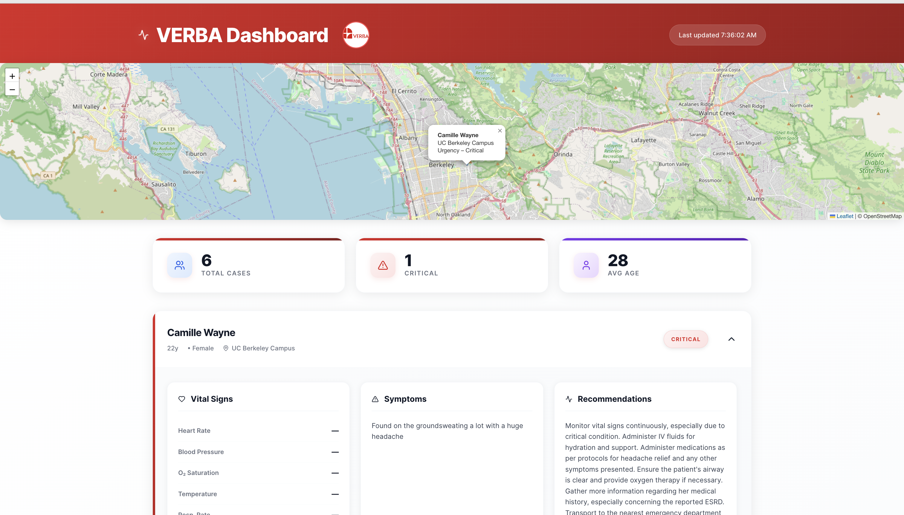
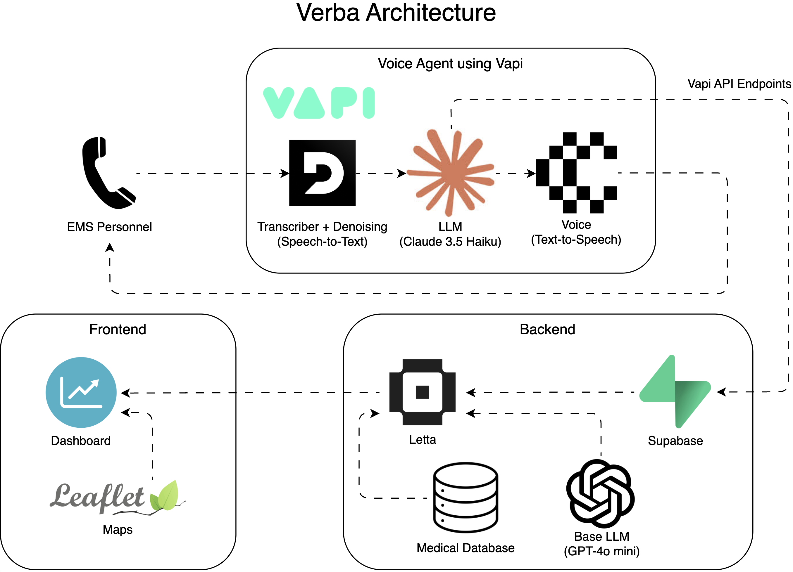

# Verba 
Verba is a real-time voice agent that ensures nothing gets lost in translation during the most critical moments of emergency responses. Designed for EMS-to-hospital handoffs, Verba listens to paramedics’ verbal reports on scene and automatically transcribes, extracts, and structures all key medical data using a voice-first, AI-assisted workflow. It’s trained to be as efficient as possible, asking clarifying questions only when absolutely necessary. 

Verba then uses advanced custom agents to deliver structured reports that appear instantly on the Doctor Dashboard prioritized on criticality, reducing time-to-treatment and minimizing human error.



## Project Overview
### Voice Agent:
- **Vapi**: Built and deployed an advanced AI voice agent. Handles natural conversations in real-time, makes and receives calls, and is built to seamlessly connect with major ePCR/EHR systems. Designed to respond only when necessary to save as much time as possible.
- **Claude**: Used for advanced language understanding and summarization. Aids in refining handoff notes into concise, medically actionable key terms and summaries for rapid physician review.

### Frontend: 
- **React application**: Real-time updates. Provides a clean, clinician-friendly UI.
- **Leaflet Maps API**: Integrated live mapping to show real-time EMS locations and scene data directly on the Doctor Dashboard. Helps doctors anticipate patient arrival and triage in advance.

### Backend: 
- **Supabase**: Used as a scalable Postgres database with built-in authentication and row-level security. Enabled real-time syncing of structured patient data and secure access control for doctors and EMS teams.
- **Medical database**: thousands of EMS-specific terminology, abbreviations, and field-data.
- **Letta**: A custom medical language model agent, based on GPT-4o mini and trained on medical database. Parses transcriptions from Vapi into structured, clinically relevant data fields for doctor review. Seamlessly connects with existing major ePCR/EHR systems like Zoll and ESO.

 

## Features
- Key medical term/feature extraction through Vapi workflow: Speech-to-Text, LLM, Text-to-Speech
- Responsive dashboard with real-time updates and map integration
- Helpful reports for doctors with critical information from paramedics and suggested further action

## Getting Started
1. Environment Setup
```
# Activate the Python virtual environment
source first_responder_env/bin/activate
```
2. Backend Setup
Install dependencies:
```
cd verba-folder
npm install
```
Set up environment variables by creating a `.env` file in the `verba-folder` directory:
```
# verba-folder/.env
LETTA_API_KEY=your_letta_api_key_here
AGENT_ID=your_agent_id_here
SUPABASE_URL=your_supabase_url_here
SUPABASE_KEY=your_supabase_key_here
```
Start the backend server:
```
# From verba-folder directory
node api/index.js
```
The API will run on http://localhost:3001

3. Frontend Setup
Install dependencies:
```
cd verba-folder/ui
npm install
```
Start the development server:
```
npm run dev
```
The dashboard will be available at http://localhost:5173 

4. Testing the system
    - Call the Voice Agent: +1 (650) 252 7577
    - Follow Verba's instructions and provide emergency data
    - Visit the dashboard at http://localhost:5173 to see structured reports appear in real-time
    - Continue calling the number if desired


